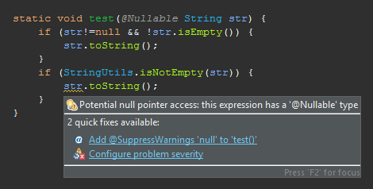

## La stringa nulla (work in progress)

L'argomento che segue, di per sé, sarebbe abbastanza irrilevante, ma lo uso come semplice esempio per esprimere concetti di fondo che sono invece molto rilevanti.

Capita spesso di dover fare controlli di questo tipo:
<pre><code>
if (str!=null && !str.isEmpty()) {
	...
}
if (str!=null && !str.trim().isEmpty()) { // Java version <11
	...
}
if (str!=null && !str.isBlank()) { // java version >=11
	...
}
</code></pre>

Nonostante la banalità dell'operazione, sono state definite varie funzioni per fare queste operazioni,
ne riporto alcune, ma sicuramente ce ne sono molte altre.
Tutte quelle riportate ammettono il valore null in ingresso:  

- Librerie Apache:  
  - [StringUtils.isEmpty(str)](https://commons.apache.org/proper/commons-lang/javadocs/api-2.6/org/apache/commons/lang/StringUtils.html#isEmpty\(lava.lang.String\))
  - [StringUtils.isNotEmpty(str)](https://commons.apache.org/proper/commons-lang/javadocs/api-2.6/org/apache/commons/lang/StringUtils.html#isNotEmpty(java.lang.String))
  - [StringUtils.isBlank(str)](https://commons.apache.org/proper/commons-lang/javadocs/api-2.6/org/apache/commons/lang/StringUtils.html#isBlank(java.lang.String))
  - [StringUtils.isNotBlank(str)](https://commons.apache.org/proper/commons-lang/javadocs/api-2.6/org/apache/commons/lang/StringUtils.html#isNotBlank(java.lang.String))
- Librerie Google:  
  - [Strings.isNullOrEmpty()](https://guava.dev/releases/19.0/api/docs/com/google/common/base/Strings.html#isNullOrEmpty(java.lang.String))

Nella versione 11 di java, hanno introdotto il metodo isBlank() nella classe String.
Come mai, già che c’erano, non hanno standardizzato i metodi <b>statici</b> come isNullOrEmpty e isBlank?

Prima di continuare a leggere, ti chiedo di pensarci un attimo… hai già trovato la risposta?

### La mia ipotesi

Avranno valutato le funzioni inutili, visto che si risparmia poco?
Addirittura, se la variabile è meno di 3 caratteri la chiamata è meno compatta:
(prendiamo in considerazione solo il problema di correttezza e leggibilità, trascurando gli irrilevanti aspetti di perfomance)
<pre><code>
s==null || s.isEmpty()
Strings.isNullOrEmpty(s)
str==null || str.isEmpty()
Strings.isNullOrEmpty(str)
string==null || string.isEmpty()
Strings.isNullOrEmpty(string)
StringUtils.isEmpty(string)
</code></pre>
Non cambia molto tra le varie forme, comunque non sarebbe costato nulla introdurla nel JDK,
visto che molti, preferiscono avere la funzione statica che accetta null (visto il proliferare delle funzioni definite)

### Il motivo deve essere un altro:

Sembra che vogliano forzarci a fare il controllo null esplicitamente, e scoraggiare l'uso di tali funzioni.
E infatti la ragione secondo me è proprio questa!
La forma esplicita aiuta uno strumento automatico (tipo quello che interpreta le annotazioni @Nullable ecc.)
a dimostrare matematicamente se la variabile sarà null o meno  

Nell'immagine si vede chiaramente la differenza: nella chiamata alla funzione, il compilatore non riesce a garantire
che la variabile non è nulla (Eclipse, con l'analisi delle annotazioni null abilitata)
Quindi se si vuole scrivere un codice pulito, senza avvisi, 100% privo di nullPointerException,
conviene fare il controllo esplicito almeno finché non avremo software in grado di dimostrare la
correttezza del codice riportato analizzando il contenuto della funzione; ma in casi appena più 
complessi di questo diventerebbe molto difficile sviluppare tali controlli, quindi meglio non aspettarsi 
queste meraviglie nel breve periodo.

Altro motivo per evitare le funzioni statiche sopra citate deriva dai concetti base della programmazione ad oggetti.
per quanto banale, questa funzione è replicata spesso in varie librerie,
talvolta più volte nello stesso progetto. Perchè? Perché nessuno si ricorda o sa che la funzione esisteva già,
perchè non c'è un posto preciso dove mettere i metodi statici, che possono essere ovunque;
questo crea confusione, e ridondanze. Invece la funzionalità implementata come metodo secondo il
paradigma ad oggetti va definita sempre in un punto ben preciso (in questo caso andrebbe nella classe String, se fosse possibile) e, cosa non trascurabile, qualsiasi IDE ci suggerirà anche il metodo mentre scriviamo.
